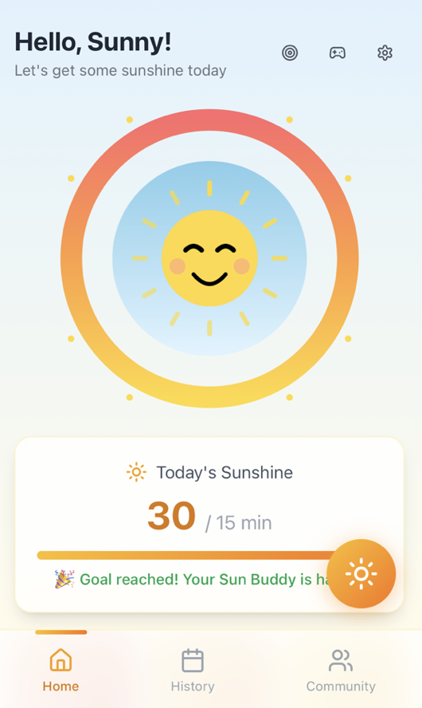
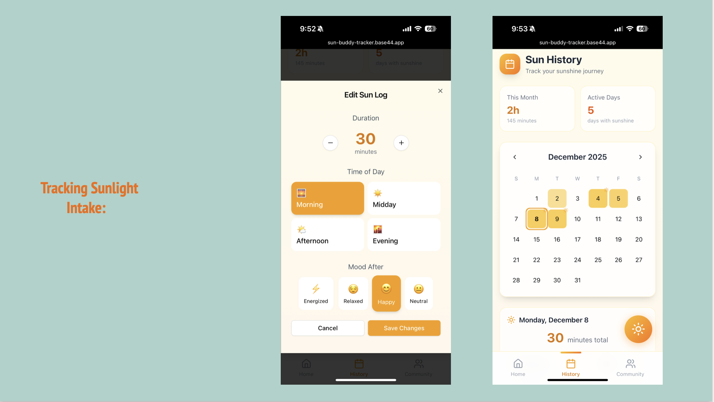
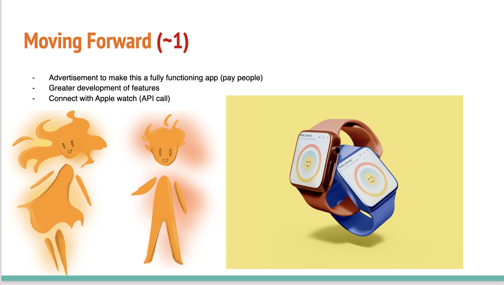
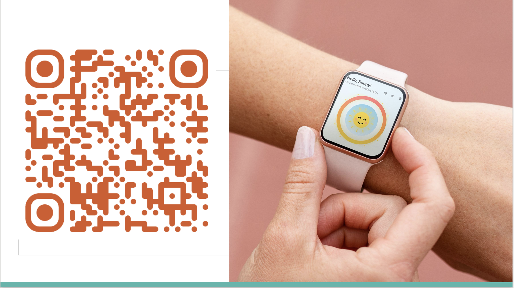
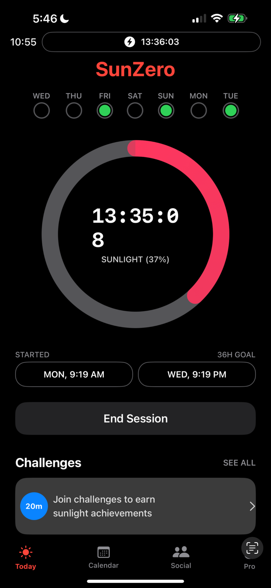
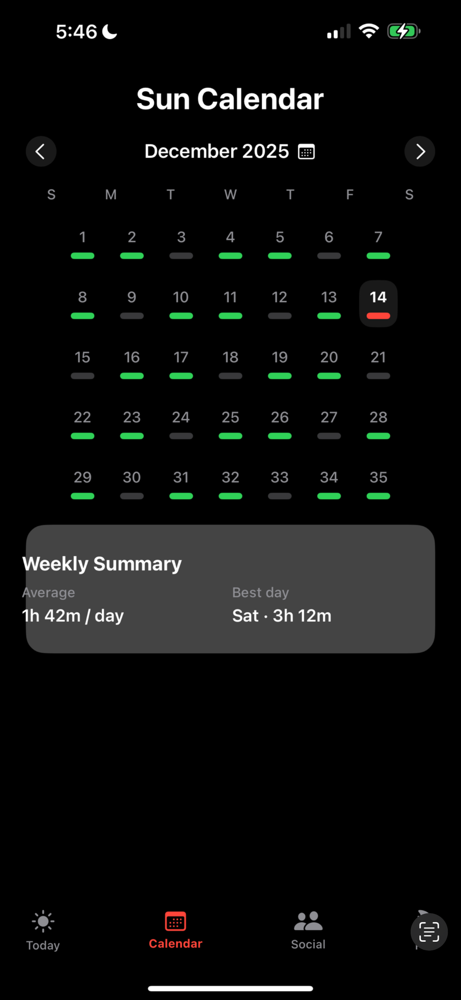
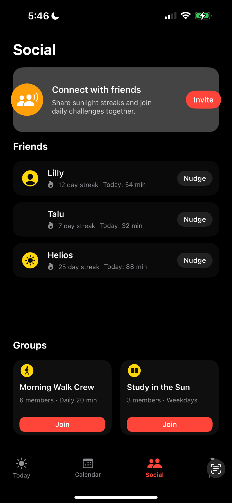

# SunBuddyApp
# ☀️ Sun Buddy  
### A Sunlight Tracking & Wellness App

## Short Description
**Sun Buddy** is a sunlight tracking app that helps users visualize daily and weekly sun exposure through clean, encouraging UI elements. The app promotes healthier routines by making sunlight habits visible, achievable, and stress-free.

---

## Overview

Sun Buddy was developed as an **interdisciplinary wellness project** exploring how environmental factors—specifically sunlight—impact mood, energy, and daily routines. The project evolved through **two iterations**:

1. An initial **SwiftUI iOS prototype built in Xcode**
2. A refined **final version built with Base44**, chosen for its superior visual design and user experience

Both versions focus on clarity, accessibility, and positive habit formation.

## Conference Presentation & Future Vision

### IDS Conference Presentation

Sun Buddy was **presented at the IDS Conference**, where it was shared as an interdisciplinary project exploring the intersection of **technology, wellness, environmental awareness, and user-centered design**. The presentation highlighted the problem of unnoticed sunlight deprivation, the app’s design evolution, and its potential for real-world impact across mobile and wearable platforms.

---

### Apple Watch Integration (Planned)

A major future goal for Sun Buddy is to expand onto the **Apple Watch**, pending permission from Apple and access to relevant APIs.

Planned capabilities include:
- Using Apple’s **light and sensor APIs** on Apple Watch to passively track ambient light exposure
- Automatically syncing light data between Apple Watch and iPhone
- Reducing manual tracking by leveraging wearable hardware
- Providing subtle, glanceable progress indicators on the watch face

This integration would make Sun Buddy a more seamless, always-on wellness tool.

---

## 🌟 Final App (Base44 Version)

The final version of Sun Buddy was created using **Base44**, which allowed for a more polished, user-friendly interface while preserving the original project goals.

### Personalized Sunlight Recommendations

To better reflect individual needs, Sun Buddy is designed to support **customized sunlight goals** based on:

- User **age**
- Geographic **location**
- Seasonal factors

These inputs would dynamically adjust recommended daily sunlight exposure, making goals both **safer and more realistic** for each user.

### Front Page
   

  

### Calendar View
Visualizes sunlight habits across days, making weekly patterns easy to understand. You can also manually enter your suntime here. 
   

  

### Avatar / Visual Identity
The avatar (“Sola”) represents warmth, encouragement, and consistency.

   

  

  ### Social & Notification Features

The social component of Sun Buddy is designed to encourage accountability and motivation without pressure.

Planned features include:
- Optional friend connections
- Push notifications when friends reach their daily sunlight goal
- Gentle encouragement instead of competitive ranking
- Privacy-first design (no exact location sharing)

Notifications would appear on the user’s **phone** (and optionally Apple Watch), reinforcing positive habits through community support.

### QR Code to the App
Scan to access the deployed version of Sun Buddy.

   

  

> 📸 These images were captured from the **final presentation PowerPoint** and represent the completed Base44 version of the app.

---

## 📱 Original App (Xcode / SwiftUI Prototype)

The first version of Sun Buddy was developed in **Xcode using SwiftUI** and rendered directly on an iPhone simulator/device. While fully functional, the team ultimately preferred Base44’s design system for the final iteration.

### Original Front Page
   

  

### Old Calendar View
How people saw how many days they were getting sufficient sunlight

   

  

### Social View
Early concept for community or sharing features.

   

  

---

## SwiftUI Code Structure (Original App)

### File Responsibilities

- **IphonelighttrackerApp.swift**  
  App entry point and lifecycle configuration.

- **ContentView.swift**  
  Main container view handling navigation and layout.

- **SunCalenderView.swift**  
  Weekly/calendar-style visualization of sunlight exposure.

- **SunSocialView.swift**  
  Prototype view for future social or community features.

---

## Design Philosophy

Sun Buddy is intentionally designed to be:

- ☀️ **Encouraging, not demanding**
- 🧠 **Simple, not overwhelming**
- 🌱 **Habit-focused, not streak-obsessed**
- 🎨 **Visually calming and accessible**

The app avoids pressure-based metrics and instead promotes awareness and consistency.

---

## Future Enhancements

- 📍 Location-aware sunlight estimation
- 🌦️ Weather-based recommendations
- 🔔 Gentle reminders to go outside
- 📊 Long-term trend analysis
- 🤝 Optional social challenges
- 🧠 Mental wellness insights tied to seasonal patterns
- API implimentation into Apple Watch

---

## Presentation & Documentation

- **Sun Buddy Conference Presentation – IDS301 – Fall 2025**  
  [Powerpoint link](https://github.com/sophia62/SunBuddyApp/blob/main/pictures./Sun%20Buddy%20Conference%20Presentation%20-%20IDS301%20-%20Fall%202025.pptx)

---

## Conclusion

Sun Buddy was created as part of an **interdisciplinary software engineering and wellness initiative**, combining:
- App development
- Human-centered design
- Environmental awareness
- Behavioral habit support

The project emphasizes **real-world impact through small, sustainable changes**.

### Why This Matters

By combining:
- Wearable sensor data
- Environmental context (UV, weather)
- Personal customization
- Social encouragement

Sun Buddy aims to become a **holistic sunlight wellness platform**, not just a timer. The IDS Conference presentation emphasized how small, well-designed tools can meaningfully support mental and physical well-being.

---

